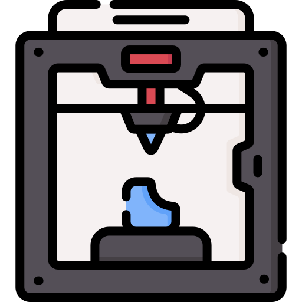

<div align="center">



# HUB Impression 3D

> Application desktop locale tout-en-un pour les makers de l'impression 3D — filaments, bobines, imprimantes, profils de découpe et calculateur de coût de revient.


</div>

Conçu pour fonctionner **100 % hors-ligne** — aucun compte, aucun serveur, toutes les données stockées localement en SQLite sur votre machine.

---

## Pourquoi ce projet ?

Quand on imprime en 3D sérieusement, on accumule rapidement :

- Plusieurs marques et types de filaments avec des réglages différents
- Des dizaines de bobines à des stades d'utilisation variés
- Plusieurs imprimantes avec leurs propres profils
- Des plateaux interchangeables aux comportements distincts
- La question récurrente : **"ça me coûte combien à produire ?"**

Les solutions existantes sont soit des spreadsheets bricolés, soit des services cloud qui nécessitent un compte et une connexion. HUB Impression 3D est une application **desktop native Windows**, 100 % locale, sans abonnement, sans publicité, sans envoi de données.

Elle se lance, elle fonctionne — hors ligne, hors réseau, pour toujours.

---

## Démarrage rapide

Au **premier lancement**, l'application se peuple automatiquement avec un catalogue de départ complet :

- **18 filaments** — PLA Basique, Silk, Metal, Glow, Mat, Haute Vitesse, PETG, TPU (marques Anycubic, eSUN, Bambu Lab…)
- **8 plateaux** — PEI (lisse / texturé), Carbon Fiber, GECO-PLATE, Holographique, JUUPINE, Neon Lines
- **2 imprimantes** — Anycubic Kobra S1 Combo (FDM multi-filament) et Anycubic Photon Mono M7 Pro (MSLA résine)

Vous avez une base exploitable dès l'ouverture. Chaque fiche est modifiable, supprimable, et vous pouvez ajouter vos propres données au-dessus.

> Données issues de [techfixbuild.fr/guide-impression-3d](https://www.techfixbuild.fr/guide-impression-3d)

---

## Fonctionnalités

### Tableau de bord

Vue synthétique de tout votre atelier d'un coup d'oeil :

- Compteurs : nombre de filaments, bobines, imprimantes, profils
- Répartition des filaments par type (PLA / PETG / TPU / Résine…)
- Palette de toutes les couleurs en stock
- **Alertes humidité** : les filaments sensibles (PETG, TPU, PA…) apparaissent en avertissement si aucune date de séchage récente n'est renseignée
- Widget **Ace Pro** : si vous avez une Anycubic Kobra S1 Combo (système multi-filament 4 emplacements), un widget dédié affiche les 4 slots avec assignation par glisser-déposer et édition du poids restant en direct

### Filaments

Catalogue complet de vos types de filaments, indépendant des bobines physiques.

Chaque fiche contient :

| Paramètre | Description |
|---|---|
| Marque / gamme / type | Ex : Anycubic / PLA Silk / PLA |
| Couleur + code hex | Prévisualisé dans l'interface |
| Température buse | Plage min / max en °C |
| Température plateau | Plage min / max en °C |
| Vitesse d'impression | Plage min / max en mm/s |
| Rétraction | Distance (mm) + vitesse (mm/s) |
| Ventilateur | Pourcentage recommandé |
| Densité | En g/cm³ (utile pour le calculateur) |
| Sensibilité humidité | Oui / Non |
| Séchage | Température + durée recommandées |
| Notes | Champ libre |
| Photo | Image `.webp` intégrée |

Vue grille (photos) ou liste (tableau), filtres par type et marque, tri multi-critères.

### Bobines

Chaque bobine physique est une entrée séparée, liée à un type de filament du catalogue.

Paramètres tracés par bobine :

- **Identifiant unique** au format `BOB-XXXX-XXXX` — généré automatiquement, modifiable
- Emplacement physique (tiroir, étagère, imprimante…)
- Poids restant en grammes (+ poids bobine vide + poids total avec bobine)
- Type de bobine (carton, plastique, métal, AMS, karton slim…)
- **Date de séchage** — génère une alerte sur le tableau de bord si ancienne
- **Calibration** : valeur K, TD (Temp. Dependent), ratio de flux
- Prix d'achat, devise, date d'achat, lien d'achat (URL)
- Notes

### Couleurs

Palette personnalisée avec code couleur hexadécimal. Permet de taguer visuellement vos filaments et de retrouver rapidement une couleur dans le catalogue.

### Imprimantes

Fiches imprimantes FDM et MSLA / Résine.

Informations stockées :

- Nom, marque, modèle
- Volume de build (X × Y × Z en mm)
- Type d'extrudeur (Direct Drive, Bowden, IDEX, Toolchanger, MSLA)
- Diamètre de buse
- Firmware
- Notes + photo

Chaque type d'extrudeur affiche des **conseils d'utilisation contextuels** adaptés dans la fiche (gestion de la rétraction pour le Bowden, avantages de l'IDEX, précautions résine pour le MSLA…).

### Plateaux

Fiches pour vos plateaux d'impression interchangeables.

- Nom, type de surface (PEI lisse, PEI texturé, PC, verre…)
- **Deux faces** : configuration face A et face B
- Plage de températures min / max
- Protocole de préparation de surface (nettoyage, colle, démoulage…)
- Filaments compatibles
- Notes + photo

### Profils d'impression

Profils de découpe sauvegardés, liés à un filament, une imprimante et un plateau.

Paramètres :

| Catégorie | Paramètres |
|---|---|
| Températures | Buse, plateau |
| Vitesses | Impression générale, périmètres, remplissage, déplacements |
| Rétraction | Distance + vitesse |
| Couche | Hauteur de couche, largeur d'extrusion |
| Remplissage | Pourcentage, motif (grille, gyroïde, nid d'abeille…) |
| Périmètres | Nombre de périmètres, couches dessus / dessous |
| Supports | Activé / désactivé |
| Adhésion | Largeur du brim |
| Ventilateur | Pourcentage |
| Notes | Champ libre |

**Import / Export :**

- **OrcaSlicer** — fichier `.json`
- **PrusaSlicer** — fichier `.ini`

Vous pouvez importer un profil depuis votre slicer et l'enrichir avec les métadonnées locales (filament, plateau, imprimante), ou exporter depuis l'application vers votre slicer.

### Calculateur de coût de revient

Outil pour estimer le prix de revient d'une pièce imprimée et calculer un prix de vente rentable.

**Entrées :**

| Poste | Détail |
|---|---|
| Filament | Poids utilisé (g) × prix au kg |
| Électricité | Puissance imprimante (W) × durée (h) × prix kWh (tarif Engie 2026 pré-rempli, modifiable) |
| Usure machine | Slider 0,05 € → 0,50 € par heure, ou saisie libre |
| Emballage | Coût optionnel (boîte, bulle, papier…) |

**Sorties :**

- Coût total de revient
- Prix de vente cible (saisi ou calculé)
- Marge brute en euros
- Pourcentage de marge
- Indicateur visuel de rentabilité (vert / orange / rouge)

---

## Stack technique

| Couche | Outil | Version |
|---|---|---|
| Shell desktop | Electron | 31 |
| Interface | React + Vite | 18 / 5 |
| Style | Tailwind CSS + CSS custom properties | 3 |
| Icônes | lucide-react | 0.395 |
| Base de données | better-sqlite3 (SQLite) | 11 |
| Routing | React Router (HashRouter) | 6 |
| Packaging | electron-builder | 24 |

Architecture :

```
Renderer (React)  ←→  contextBridge (preload.js)  ←→  Main process (Electron)  ←→  SQLite
```

- Le renderer ne touche jamais directement Node.js ni le système de fichiers
- Le preload expose une API `window.api` typée (IPC sur canaux nommés `entité:opération`)
- SQLite fonctionne en mode WAL pour de meilleures performances en lecture concurrente
- Les migrations sont non-destructives (`ALTER TABLE … ADD COLUMN`) — une mise à jour ne remet jamais les données à zéro

---

## Prérequis

- Node.js 18+
- npm 9+
- Windows 10 / 11

---

## Installation (développement)

```bash
git clone https://github.com/TechFixBuild/hub-impression-3d.git
cd hub-impression-3d
npm install
```

> Le hook `postinstall` compile automatiquement `better-sqlite3` pour le runtime Electron via `@electron/rebuild`. Aucune action supplémentaire requise.

---

## Lancer en développement

```bash
npm run dev
```

Vite démarre sur `http://localhost:5173`, Electron s'ouvre automatiquement avec hot-reload React.

---

## Build Windows

```bash
npm run dist
```

Génère dans `dist/` :

| Fichier | Type |
|---|---|
| `HUB Impression 3D Setup 1.0.0.exe` | Installateur NSIS (choix du répertoire) |
| `HUB Impression 3D 1.0.0 Portable.exe` | Exécutable portable autonome (aucune installation) |

---

## Structure du projet

```
hub-impression-3d/
├── electron/
│   ├── main.js          # Processus principal — fenêtre BrowserWindow, handlers IPC
│   ├── preload.js       # Bridge contextBridge : expose window.api au renderer
│   ├── database.js      # Schéma SQLite, migrations automatiques, toutes les requêtes CRUD
│   └── seed.js          # Données initiales (filaments, plateaux, imprimantes) + images
├── src/
│   ├── main.jsx         # Point d'entrée React, HashRouter
│   ├── App.jsx          # Définition des routes
│   ├── components/
│   │   ├── Layout.jsx       # Sidebar 220px + toggle thème
│   │   ├── Modal.jsx        # Modale générique
│   │   └── ConfirmDialog.jsx
│   └── pages/
│       ├── Dashboard.jsx    # Tableau de bord + widget Ace Pro
│       ├── Filaments.jsx    # Catalogue filaments
│       ├── Couleurs.jsx     # Palette de couleurs
│       ├── Imprimantes.jsx  # Gestion imprimantes
│       ├── Plateaux.jsx     # Gestion plateaux
│       ├── Profils.jsx      # Profils d'impression + import/export
│       └── Calculateur.jsx  # Calculateur de coût de revient
├── public/
│   └── impression-3d/
│       ├── filaments/   # 18 photos .webp
│       ├── plaques/     # 8 photos .webp
│       └── printers/    # Photos imprimantes
├── logo.png
├── vite.config.mjs
├── tailwind.config.js
└── package.json
```

---

## Base de données

Stockée automatiquement dans le profil utilisateur Windows :

```
%APPDATA%\hub-impression-3d\hub-impression-3d.sqlite
```

Les migrations sont appliquées au démarrage — aucune action manuelle requise lors d'une mise à jour.

**Réinitialiser complètement (supprime toutes les données) :**

```powershell
Remove-Item "$env:APPDATA\hub-impression-3d\hub-impression-3d.sqlite"
```

Au prochain lancement, la base est recréée et le seed est réinjecté.

---

## Contribuer

Contributions bienvenues : bugs, nouvelles fonctionnalités, traductions, images de filaments supplémentaires.

1. Forkez le dépôt
2. Créez une branche : `git checkout -b feature/ma-fonctionnalite`
3. Committez : `git commit -m 'feat: description courte'`
4. Poussez : `git push origin feature/ma-fonctionnalite`
5. Ouvrez une Pull Request

---

## Licence

MIT — voir [LICENSE](LICENSE).

Développé par [TechFix&Build](https://techfixbuild.fr)
